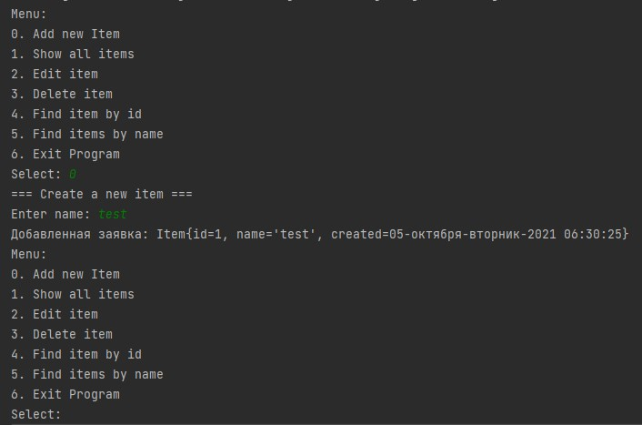

# job4j_tracker
О проекте

## Это учебный проект Tracker. 
Этот проект - консольное приложение. Пользователю отображается меню с возможностями программы.
Программа может:
1. Добавлять заявку.
2. Заменять заявку на новую заявку по ID.
3. Удалять заявку по ID.
4. Отображать список всех заявок.
5. Производить поиск по имени заявки.

Поведение пользователя
Пользователь запускает программу и видит меню. Программа просит ввести в консоль пункт меню для дальнейшего действия.
Например, пользователь ввел цифру 1. Система просит пользователя ввести имя заявки. После этого действия система 
сохраняет в памяти заявку и снова отображает пункты меню. Если пользователь выбрал пункт 6 - это будет выход из 
программы, т.е. программа закрывается. Программа имеет тривиальные действия. В ней мы будем продолжать использовать 
операторы ветвления, циклы и массивы. Но первостепенную роль в этом проекте займут объекты.
Сборка или установка. На данный момент использую сборщик Maven;
#### Этот проект созан в учебных целях 
контакты. 
